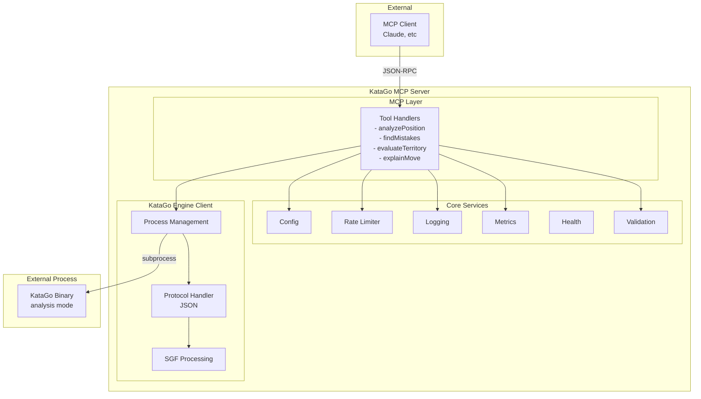
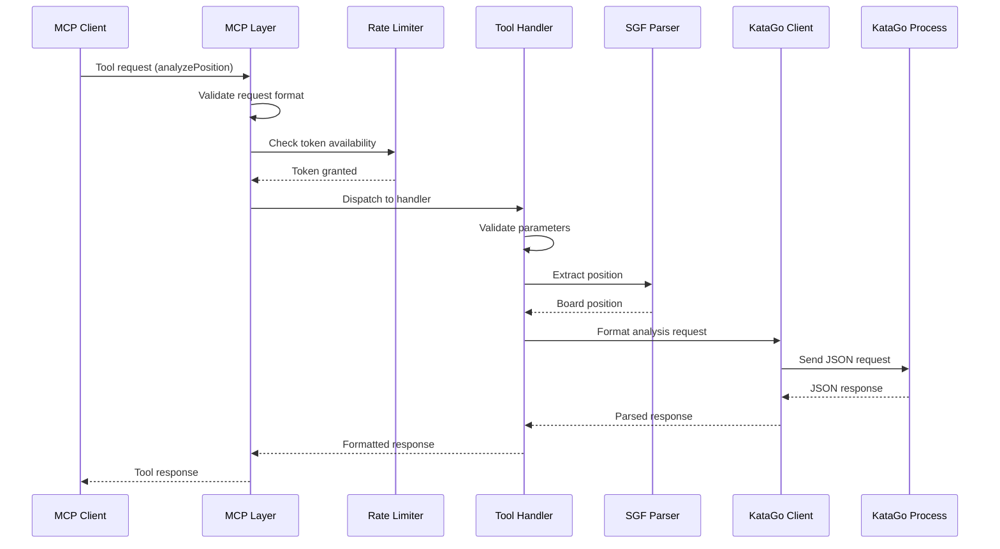
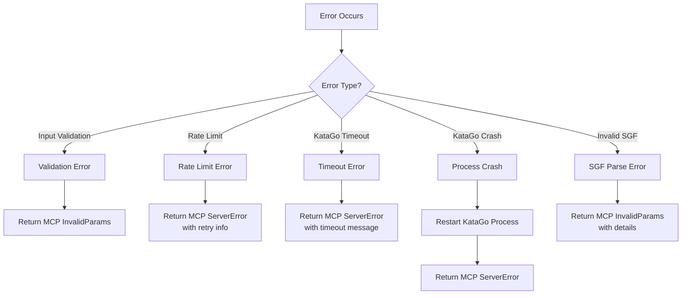

# KataGo MCP Server Architecture

## Overview

The KataGo MCP Server provides a Model Context Protocol interface to KataGo's analysis engine, enabling AI assistants to analyze Go games, find mistakes, evaluate positions, and explain moves. The architecture follows production-ready patterns established in the ogs-mcp project.

## System Architecture

## Component Details

### 1. MCP Layer (`internal/mcp/`)

**Responsibilities:**
- Handle MCP protocol communication
- Register and dispatch tool calls
- Manage request/response lifecycle
- Apply rate limiting per tool
- Collect metrics

**Key Files:**
- `tools.go` - Tool registration and dispatching
- `handlers.go` - Individual tool implementations
- `errors.go` - MCP error code mapping

### 2. KataGo Engine Client (`internal/katago/`)

**Responsibilities:**
- Manage KataGo subprocess lifecycle
- Handle JSON protocol communication
- Parse and validate SGF input
- Convert between SGF and KataGo formats
- Handle timeouts and errors

**Key Files:**
- `engine.go` - Process management
- `protocol.go` - JSON protocol types
- `sgf.go` - SGF parsing and validation
- `analysis.go` - Analysis request/response handling

### 3. Core Services

#### Configuration (`internal/config/`)
- Load from environment variables (priority)
- Load from JSON config file
- Validate configuration
- Provide defaults

#### Logging (`internal/logging/`)
- Structured logging to stderr
- Log levels (debug, info, warn, error)
- Context propagation
- Request ID tracking

#### Rate Limiting (`internal/ratelimit/`)
- Token bucket algorithm
- Per-tool rate limits
- Graceful degradation
- Metrics integration

#### Health (`internal/health/`)
- KataGo process health
- Memory usage monitoring
- Request latency tracking
- Readiness/liveness checks

#### Validation (`internal/validation/`)
- SGF format validation
- Move coordinate validation
- Parameter bounds checking
- Security sanitization

#### Metrics (`internal/metrics/`)
- Request counts per tool
- Latency histograms
- Error rates
- KataGo resource usage

## Data Flow

### 1. Analysis Request Flow

### 2. Error Handling Flow

## Security Considerations

### 1. Input Validation
- Sanitize all SGF input to prevent injection
- Validate move coordinates are within board bounds
- Limit analysis depth to prevent resource exhaustion
- Validate file paths (if any) are within allowed directories

### 2. Process Isolation
- Run KataGo with minimal privileges
- Use process groups for cleanup
- Set resource limits (CPU, memory)
- No network access for KataGo process

### 3. Rate Limiting
- Per-tool rate limits
- Global rate limit
- Client identification (future)
- Graceful degradation

## Performance Considerations

### 1. KataGo Process Management
- Single long-running process (not per-request)
- Process pooling for concurrent requests (future)
- Graceful restart on errors
- Health monitoring

### 2. Caching Strategy
- Cache analysis results by position hash
- TTL based on analysis depth
- Memory-bounded cache
- Cache metrics

### 3. Resource Management
- Limit concurrent analyses
- Queue requests when at capacity
- Timeout long-running analyses
- Monitor memory usage

## Extensibility

### 1. Adding New Tools
1. Define tool in `internal/mcp/tools.go`
2. Implement handler in `internal/mcp/handlers.go`
3. Add KataGo client method if needed
4. Add tests and documentation

### 2. Supporting Multiple Engines
- Abstract engine interface
- Engine factory pattern
- Configuration per engine
- Feature detection

### 3. Plugin System (Future)
- Custom analysis tools
- External processors
- Result transformers
- Custom metrics

## Testing Strategy

### 1. Unit Tests
- Mock KataGo subprocess
- Test each component in isolation
- Edge case coverage
- Error scenario testing

### 2. Integration Tests
- Full flow with test KataGo
- Concurrent request handling
- Error recovery testing
- Performance benchmarks

### 3. Security Tests
- Fuzzing SGF inputs
- Injection attempt detection
- Resource exhaustion prevention
- Process isolation verification

## Deployment Considerations

### 1. Configuration
- Environment-based config
- Secrets management
- Feature flags
- Rolling updates

### 2. Monitoring
- Structured logs to stderr
- Metrics endpoint (future)
- Health check endpoint
- Distributed tracing (future)

### 3. Scaling
- Horizontal scaling via load balancer
- Process pool per instance
- Shared cache (Redis, future)
- Queue for heavy analyses

## Dependencies

### External
- `github.com/mark3labs/mcp-go` - MCP protocol
- `golang.org/x/time/rate` - Rate limiting
- KataGo binary and models

### Internal
- Minimal external dependencies
- Standard library preferred
- Well-tested libraries only
- Security-reviewed dependencies